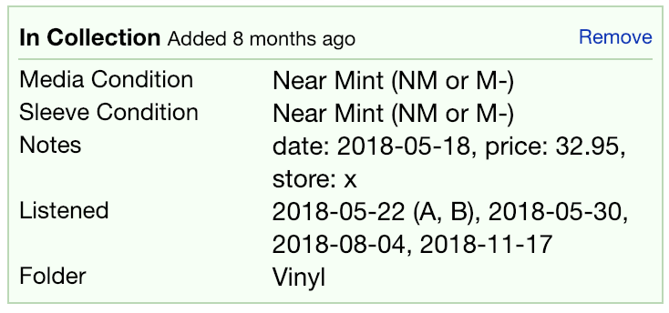
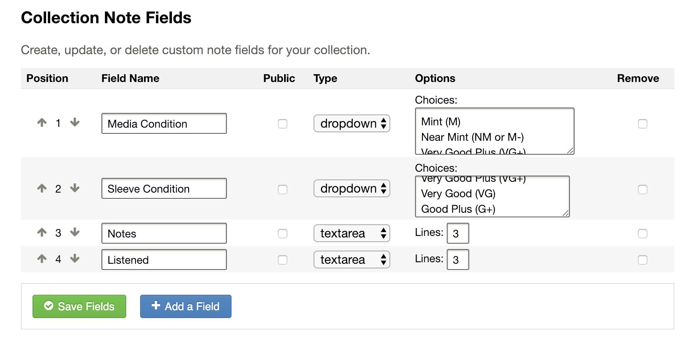

# Disclio - Discogs CLI

Discogs command line interface. Based on Vorpal CLI framework and Disconnect library.

## Usage

Generate your user token in https://www.discogs.com/settings/developers.

Start app by commanding ```node disclio.js```. For further instructions, type ```help```.

## Statistics

Disclio shows some statistics of listenings and purchases. To accomplish this, you must provide that information in custom fields.



Fields can be managed at https://www.discogs.com/settings/collection.



## TODO

More documentation
